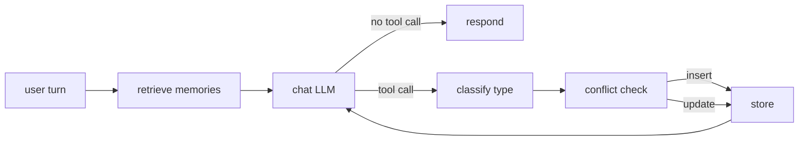

# sage-agent

## What this is

A memory-augmented conversational agent built on LangGraph, extending the
[`langchain-ai/memory-agent`](https://github.com/langchain-ai/memory-agent)
template with **semantic retrieval**, **conflict resolution**, **typed memory**
(facts / preferences / episodic events), and — most importantly — a **50-case
evaluation suite** that turns every "improvement" into a measurable delta
instead of a vibe.

The README leads with numbers, not features. Week 1 ships the baseline and
the eval harness so weeks 2–4 can claim measurable wins against it.

## Results

| Category               | Baseline | Week 2 (semantic + conflict) | Week 3 (typed) | Final |
|------------------------|---------:|-----------------------------:|---------------:|------:|
| `should_save_fact`     |  100.0% |                       100.0% |              — |     — |
| `should_save_preference` | 100.0% |                     100.0% |              — |     — |
| `should_save_episodic` |   80.0% |                        80.0% |              — |     — |
| `should_not_save`      |  100.0% |                       100.0% |              — |     — |
| `contradiction_update` |    0.0% |                    **57.1%** |              — |     — |
| `retrieval_relevance`  |   90.0% |                        80.0% |              — |     — |
| **Save-decision P / R / F1** | 1.000 / 0.967 / 0.983 | 1.000 / 0.967 / 0.983 | — / — / — | — / — / — |

> **Baseline** (`baseline_20260524T094912Z.json`): `openai/gpt-oss-120b:free`
> via OpenRouter, 50 cases, in-memory store, blind append, dump-all retrieval.
> `contradiction_update` sits at 0% by design (blind append can't update
> existing memories), and `retrieval_relevance` looks high at 90% only
> because the stub returns *all* user memories.
>
> **Week 2** (`week2_20260524T105957Z.json`): Chroma + `all-MiniLM-L6-v2` for
> properly-scoped top-`k=5` semantic retrieval, plus an LLM-judge conflict
> resolution subgraph (top-3 neighbors, judge decides insert vs
> DELETE-then-INSERT). Headline: **`contradiction_update` 0% → 57.1%** (4 of
> 7 same-facet updates now collapse the prior memory instead of appending).
> Save-decision F1 holds at 0.983, which is the point of the
> DELETE-then-INSERT pattern — `replace` still counts as a save.
> `retrieval_relevance` slipped one case (case_043 — model asks for context
> instead of applying the retrieved "User is vegetarian" memory; flaky
> across re-runs at temperature 0 on the free tier). The remaining
> `contradiction_update` failures (035 "moved from Bangalore to Mumbai",
> 036 "left Acme — at Globex now", 040 "sold Camry — driving Tesla now") are
> all the judge mis-routing same-facet substitutions as inserts; tuning the
> judge prompt to add a substitution example traded these for others, so
> we're shipping the cleaner version and revisiting in Week 4.

## Architecture



**Node-by-node** (current status in parens):

- **retrieve memories** — embed the latest user message via
  `sentence-transformers all-MiniLM-L6-v2`, query the Chroma store for
  top-`RETRIEVAL_K` (=5) similar memories scoped to `user_id`, write to
  `state.retrieved_memories`. *(Week 2: live.)*
- **chat LLM** — system prompt + retrieved memories + history → either a
  natural response or a `save_memory` tool call. *(live since Week 1.)*
- **classify type** — route the candidate memory to `fact` / `preference` /
  `episodic`. *(Week 3 — still absent; everything is type-less today.)*
- **conflict check** — for each save, semantic-search top-3 similar existing
  memories, then an LLM judge decides insert-vs-replace; replace is
  implemented as DELETE-then-INSERT (not upsert) so the runner's
  save-decision metric still counts it as a save. *(Week 2: live, folded
  into `store_memory` rather than a separate node so the N tool_calls / N
  ToolMessages pairing the LLM expects stays intact.)*
- **store** — Chroma collection (`sage_memories`) with namespace encoded as
  metadata; one shared collection across all users keeps eval per-case
  setup cheap. *(Week 2: live via `ChromaStore`.)*

## How it works

**LangGraph state machine.** Each user turn enters at `call_model`. If the
model emits a `save_memory` tool call, the graph routes to `store_memory`
which executes the tool (injecting `store` and `user_id` from config),
appends a `ToolMessage`, and loops back to `call_model` so the LLM can
produce a natural response. If no tool call, the graph ends.

**Memory store.** Week 2 swaps `InMemoryStore` for `ChromaStore`, a
`BaseStore` subclass wrapping a single Chroma collection. The langgraph
contract is satisfied by implementing `batch` / `abatch` (the only abstract
methods); high-level ops dispatch through them. Namespace tuples are
encoded as Chroma metadata so one collection holds memories for every
user — namespace isolation is a where-filter on every op. `make_store()`
returns an `EphemeralClient` by default (eval is hermetic per case);
`make_store(persist_dir=".chroma/")` is what the CLI uses for cross-process
persistence.

**Eval harness.** `tests/eval/cases.json` carries 50 cases across six
categories. The runner spins up a fresh store per case, optionally
pre-loads `setup_memories`, runs the conversation through the graph, and
scores against three predicates:

- `memory_content_contains` — **all** substrings must appear across newly-saved memories
- `response_contains` — **any** substring must appear in the final response
- `contradiction_update` — exactly one memory must remain for that user, carrying the new value

Results land in `tests/eval/results/baseline_<UTC>.json` alongside aggregate
metrics: per-category pass rate plus a global save-decision precision /
recall / F1 treating `should_save` as a binary classifier.

## Tradeoffs considered

**Local sentence-transformers vs OpenAI embeddings.** Local
(`all-MiniLM-L6-v2`) is $0 and good enough for thousands-scale stores. API
embeddings buy ~5% retrieval quality at the cost of a paid dependency that
breaks the project's $0 constraint. For a portfolio project where the
demo-on-free-tier story matters as much as the absolute metric, local wins.
The interface stays swappable.

**Chroma vs Pinecone.** Chroma is embedded and zero-ops — `pip install`
and you're done. Pinecone is a managed service: better scaling, a paid
account, and a deploy story this project doesn't need. Chroma also lets the
whole eval run offline in CI.

**`openai/gpt-oss-120b:free` (via OpenRouter) vs Claude.** Claude has the
best tool calling, but Anthropic doesn't offer a sustained free tier.
`openai/gpt-oss-120b:free` has the strongest tool calling among the
currently-available free OpenRouter models, which is the deciding factor
since both `save_memory` and the conflict-resolution judge are tool /
structured-output calls. `model.py` is a one-function swap if you want to
move to Claude later. (The original baseline used `gemini-2.0-flash-exp:free`;
OpenRouter retired it in early 2026.)

**Lazy embedder load.** `all-MiniLM-L6-v2` is loaded on first call, not at
module import. Importing `sage_agent.graph` happens at CLI startup *and*
at eval-runner startup, and a 3–5s blocking load just to type `--help`
isn't worth it. First user turn pays the cost; everything after is fast.

**One Chroma collection vs one-per-namespace.** Single shared collection
with namespace-as-metadata wins because the eval creates 50 stores per
run and Chroma's per-collection overhead adds up. Cross-namespace isolation
is enforced by a where-filter on every op, with composite IDs
(`f"{ns0}::{ns1}::{key}"`) preventing collisions in the shared id-space.

**Judge model: same as the assistant.** The conflict-resolution judge uses
the same `openai/gpt-oss-120b:free` model as the assistant — no second
OpenRouter rate-bucket, no extra config plumbing in `model.py`. If the
judge's added latency becomes a problem at higher save volumes, swap to a
smaller free-tier model with a 2-line change.

**DELETE-then-INSERT, not upsert.** Conflict-resolution's `replace`
path deletes the matched memory and inserts a new UUID-keyed memory rather
than overwriting in place. The eval runner's save-decision metric counts
"new memories" by filtering out keys prefixed `setup_` (the pre-loaded
ones); a same-key overwrite of a setup key would pass the per-category
predicate but tank save-decision recall. The new UUID makes the case count
as a true positive.

**No similarity-threshold gate on the judge.** When the candidate has any
top-K neighbors, the judge is always invoked. Simpler than picking a
threshold to defend, and the few-shot covers "different facet → insert"
adequately. If eval shows over-replacement at higher save volumes,
revisit.

## Setup

```bash
# 1. Install deps (uv)
uv sync

# 2. Configure
cp .env.example .env
# edit .env and set OPENROUTER_API_KEY (free key at https://openrouter.ai/keys)

# 3. Chat with the agent
uv run python -m sage_agent.cli --user-id alice
```

CLI commands inside the REPL: `/new` (new thread, same user — memories
persist), `/memories` (dump store for this user), `/quit`.

## Running the eval

```bash
# Validate cases without hitting the API
uv run python -m tests.eval.runner --dry-run

# Smoke test (first 5 cases)
uv run python -m tests.eval.runner --limit 5

# Single category
uv run python -m tests.eval.runner --category should_save_fact

# Full 50-case run
uv run python -m tests.eval.runner
```

Each run writes `tests/eval/results/baseline_<UTC>.json` and prints a
summary table. Re-label with `--label week2` etc. when running improved
versions.

## Roadmap

- **Week 1** ✅ — Baseline ReAct agent (in-memory store, blind append, no
  retrieval) + 50-case eval harness + this README.
- **Week 2** ✅ — Semantic retrieval (Chroma + `all-MiniLM-L6-v2`) and
  conflict-resolution save subgraph (semantic-search top-3 similar, LLM
  judge decides insert vs replace, replace as DELETE-then-INSERT). CLI
  gets cross-process persistence at `.chroma/`. See Results table for
  measured deltas.
- **Week 3** — Typed memory: classifier node routes candidates to
  fact / preference / episodic; type-specific retention metadata; type-aware
  retrieval cues. Ship gate: improvement reflected in eval.
- **Week 4** — Decay / consolidation, Streamlit UI, hosted demo, README
  rewrite with final numbers, blog post. Ship gate: live demo URL.
