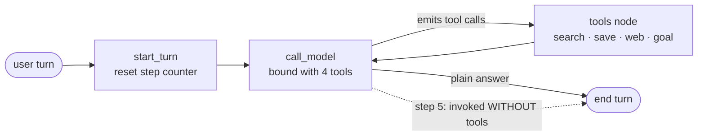

# sage-agent

A memory-augmented chat agent: a LangGraph ReAct loop that decides for itself when to recall a memory, save one, search the web, or track a goal — paired with two evaluation suites that measure whether it makes those calls correctly.

> **Live demo:** [sage-agent.streamlit.app](https://sage-agent.streamlit.app/) — tell it something about yourself, reload the page, and ask it back.

## What it does

A conversational agent is only useful across sessions if it can decide *what* about you is worth keeping, reconcile new information against what it already stored, and pull the right memory back at the right moment. Building that is one problem; knowing whether it actually works is another. sage-agent is both halves — a working memory agent, and the harness that grades its behavior.

It began as the [`langchain-ai/memory-agent`](https://github.com/langchain-ai/memory-agent) template and replaced the template's "dump every memory into the prompt" stub with semantic retrieval, conflict-resolving writes, and typed memory. From there the fixed retrieve → respond → save pipeline was converted into a model-driven loop over four tools. Every change is recorded as a delta in a committed results file, so the numbers below reproduce from git history.

The agent calls four tools:

- **`search_memory`** — semantic top-`k` recall of what you told it before (Chroma + local `all-MiniLM-L6-v2`), scoped per `user_id`.
- **`save_memory`** — store a new memory, with type classification (`fact` / `preference` / `episodic`) and an LLM judge that decides insert vs. replace.
- **`web_search`** — keyless DuckDuckGo lookup (`ddgs`) for current or external facts you didn't supply.
- **`manage_goal`** — set / list / update personal goals, kept as a separate `goal` memory type with a status and creation timestamp.

It runs on a free OpenRouter model and local embeddings, so a clone costs nothing to demo on a free key.

## How it works

**The defining decision: retrieval is a tool the model chooses, not a step the graph forces.** The pre-agentic version always ran a `retrieve_memories` node before every reply. Here that node is gone — the model calls `search_memory` only when recall would help, calls `web_search` when the answer is external, calls neither when it already knows, and reads the results back inline as it reasons. The `retrieval_relevance` eval rows (100%, below) confirm the free-tier model reliably reaches for memory when the answer lives there.

The graph is a bounded ReAct loop:



`START → start_turn → call_model ⇄ tools → END`.

- **`start_turn`** resets the per-turn step counter (`State.step`) to 0. The reset matters because the CLI and Streamlit run with a checkpointer, so `State` persists across turns and an un-reset counter would leak the cap from one turn into the next.
- **`call_model`** binds all four tools and either emits tool calls or answers in plain text. On the fifth model step (`MAX_MODEL_STEPS = 5`) it is invoked **without** tools, so a tool call becomes impossible and the loop is guaranteed to terminate with an answer. That makes termination structural rather than hopeful — the price is at most four tool-calling steps per turn, which is plenty.
- **`tools`** executes every tool call concurrently, each with **one retry then graceful degradation**: a malformed or transiently failing call returns an error `ToolMessage` instead of raising, so the turn continues and the model answers without the tool rather than crashing.

### The save path

`save_memory` is the most involved tool, and its logic lives **inside** the `tools` node rather than in a separate graph node. The reason is protocol: the chat-completions API requires N `ToolMessage`s back for the N tool calls the model emitted in one hop, and splitting the save into its own node would either break that pairing or force a second model round-trip just to re-emit the call. One node, one round-trip.

For each save:

1. Semantic-search the top-3 existing memories nearest the candidate.
2. **No neighbors** → a small dedicated classifier assigns the type, and the memory is written under a fresh UUID.
3. **Neighbors exist** → an LLM judge classifies the type **and** decides insert vs. replace in one structured-output call. `replace` is gated to same-type-and-same-facet; a cross-type "replace" is downgraded to an insert by a post-validator.
4. `replace` is implemented as **DELETE-then-INSERT** (a new UUID), not an in-place overwrite.

That last point is deliberate and load-bearing for honest measurement. The eval counts a save by spotting a new, non-setup memory key; an in-place overwrite of a seeded memory would satisfy the contradiction check but register as "no save," tanking save-decision recall. The new UUID keeps a contradiction update counting as the save it actually is.

### Keeping goals out of the auto-classifier

Goals share the same Chroma store as memories, stored with `type="goal"`. But the save path's classifier and judge are typed to a narrow `ClassifiableType = Literal["fact", "preference", "episodic"]` — they physically cannot emit `goal`. A goal is reachable **only** through `manage_goal`. This stops an offhand "I want to learn French" from being silently filed as a goal by `save_memory`, and, because the judge can only target the three classifiable types, it also protects goals from being replaced as a side effect of an ordinary save.

### Memory store

`ChromaStore` is a LangGraph `BaseStore` subclass over a single Chroma collection (`sage_memories`); the store contract is satisfied by implementing `batch` / `abatch`, and the higher-level `get` / `put` / `search` / `delete` dispatch through them. Namespace tuples (`("memories", user_id)`) are encoded as metadata and scoped with a where-filter on every operation, so one collection holds every user's memories — which keeps the eval cheap, since it spins up a fresh store per case. Embeddings are computed locally by a lazily loaded `all-MiniLM-L6-v2` (no embed cost on `--help` or dry-runs). `make_store()` returns an in-memory `EphemeralClient` for hermetic eval runs; `make_store(persist_dir=".chroma/")` returns a `PersistentClient` for the CLI and Streamlit.

## Evaluation

Both suites run on `openai/gpt-oss-120b:free` via OpenRouter at temperature 0. The free tier is non-deterministic even at temp 0, so action-selection is reported as a **range across three runs**, not a single figure. Result JSONs are committed, so each table reproduces from the cited file.

### 50-case memory suite

Source: `tests/eval/results/phase4_20260531T194151Z.json` — the agentic re-baseline. Retrieval is model-driven now, so these numbers describe the current graph and supersede the pre-agentic week-by-week runs.

| Category                 | Pass rate          | Type accuracy   |
|--------------------------|-------------------:|----------------:|
| `should_save_fact`       | **100%** (10/10)   | 90.0% (9/10)    |
| `should_save_preference` | **100%** (8/8)     | 87.5% (7/8)     |
| `should_save_episodic`   | 80.0% (4/5)        | 60.0% (3/5)     |
| `should_not_save`        | **100%** (10/10)   | —               |
| `contradiction_update`   | 85.7% (6/7)        | 85.7% (6/7)     |
| `retrieval_relevance`    | **100%** (10/10)   | —               |

**Save-decision precision / recall / F1: 1.000 / 0.967 / 0.983** (tp 29, fp 0, fn 1, tn 20). **Type accuracy: 83.3%** (25/30 type-eligible cases).

Reading the rows honestly:

- **`contradiction_update` is 85.7%, not 100%.** Same-facet updates collapse the prior memory correctly in 6 of 7 cases. The holdout is the case_040 Camry→Tesla substitution, which the free-tier judge flips between pass and fail across re-runs.
- **`retrieval_relevance` holds at 100% despite retrieval now being optional** — the model chooses `search_memory` reliably when the answer is in memory.
- **Save-decision F1 = 0.983 is the headline invariant.** It survives the pipeline → ReAct conversion because `replace` is DELETE-then-INSERT and still counts as a save. The single false negative (recall 0.967) is the long-standing case_021 episodic miss, which has failed every run since baseline.
- **Type accuracy 83.3%** — strong on facts and contradiction updates; the classifier stays fuzzy on borderline preference-vs-fact ("does not drink coffee" → fact) and episodic-vs-fact ("graduated from IIT Delhi in 2018" → episodic on the temporal anchor).

### 34-case action-selection suite

Sources: `tests/eval/results/phase4b_run{1,2,3}_20260603T*.json`. A case passes only if the model calls **exactly** the expected tool(s) — hitting the target tool **and** not over-calling; `should_chain` cases must match an ordered `expected_sequence`.

| Run | Overall          | Failing cases                      |
|----:|-----------------:|------------------------------------|
| 1   | **94.1%** (32/34) | `act_031`, `act_032`              |
| 2   | **94.1%** (32/34) | `act_031`, `act_032`              |
| 3   | 91.2% (31/34)     | `act_029`, `act_031`, `act_032`   |

**Range 91.2% – 94.1%, mean 93.1%.** Per-category on the worst run (run 3): `search_memory` 4/4, `web_search` 6/6, `manage_goal` 7/7, `save_memory` 6/6, `should_no_tool` 7/9, `should_chain` 1/2.

The sub-100% is the finding, not noise — it's an over-action bias in the free-tier model:

- **`act_031` (fails 3/3).** "I finally did it — mark my goal as done!" with **two** active goals in the store. The safe move is to ask *which* goal (no tool); the model fires `manage_goal` anyway and risks closing the wrong one. The chosen label is intentionally strict — calling `manage_goal(list)` to show options is also defensible, and the case documents that.
- **`act_032` (fails 3/3).** "Remind me what my name is — oh wait, never mind, it's Alex." The user answers mid-sentence, so any tool call is wasted; the model saves anyway.
- **`act_029` (fails 1/3, flaky chain).** "What's the weather where I live?" with the city in memory. Expected `search_memory` → `web_search`; in run 3 the model called no tool and answered from nothing. The ordered chain scorer caught the dropped plan; it passed in runs 1–2.

Deeper methodology — what each category tests, why scoring is shaped the way it is, and how to extend the suite without breaking cross-phase comparability — is in [`docs/EVAL.md`](docs/EVAL.md).

## Setup

Requires Python ≥ 3.11 and [`uv`](https://docs.astral.sh/uv/).

```bash
uv sync                       # install dependencies from uv.lock
cp .env.example .env          # then edit .env and set OPENROUTER_API_KEY
```

A free OpenRouter key takes a minute to create at <https://openrouter.ai/keys>. `MODEL_NAME` in `.env` defaults to `openai/gpt-oss-120b:free`.

## Usage

**Terminal REPL:**

```bash
uv run python -m sage_agent.cli --user-id alice
```

```
sage-agent | user_id=alice | thread=1a2b3c4d | store=.chroma/
Commands: /new  /memories  /quit

you> I'm a backend engineer and I prefer Postgres over MySQL.
bot> Noted — I'll remember that.
you> /new
[new thread: 9f8e7d6c]
you> which database do I prefer?
bot> You prefer Postgres over MySQL.
```

`/new` starts a fresh conversation thread while memories persist (that is the whole point — conversation state and long-term memory are decoupled). `/memories` dumps everything stored for the current user; `/quit` exits. By default the store persists to `.chroma/`; pass `--persist-dir ""` for in-memory only.

**Streamlit UI:**

```bash
uv run streamlit run src/sage_agent/app.py
```

The sidebar shows the user's stored memories, type-tagged, and persists across page reloads via `.chroma/`.

## Running the evaluations

The "tests" here are the two evaluation harnesses, not a unit-test suite. Each run writes `tests/eval/results/<label>_<UTC>.json` and prints a summary table.

```bash
# Memory suite (50 cases, 6 categories)
uv run python -m tests.eval.runner --dry-run               # validate cases, no LLM calls
uv run python -m tests.eval.runner --limit 5               # smoke test (first 5 cases)
uv run python -m tests.eval.runner --category should_save_fact
uv run python -m tests.eval.runner --label phase4          # full run with a label

# Action-selection suite (34 cases, 6 tool-choice categories)
uv run python -m tests.eval.action_runner --runs 3 --label phase4b   # 3 runs → accuracy range
```

When scoring rules change but the agent's outputs haven't, re-score a stored run offline — no LLM calls:

```bash
uv run python -m tests.eval.rescore tests/eval/results/phase4_20260531T194151Z.json
```

What they cover:

- `tests/eval/runner.py` — 50 cases across `should_save_fact` (10), `should_save_preference` (8), `should_save_episodic` (5), `should_not_save` (10), `contradiction_update` (7), and `retrieval_relevance` (10). Each runs in a fresh store with optional seeded memories, then scores the save decision, the assigned type, retrieval relevance, and whether a contradiction collapsed to a single updated memory.
- `tests/eval/action_runner.py` — 34 cases across `should_search_memory` (4), `should_web_search` (6), `should_manage_goal` (7), `should_save_memory` (6), `should_no_tool` (9), and `should_chain` (2). It reuses `run_case` and scores whether the model called exactly the expected tool(s), with `should_chain` scored by ordered sequence. `--runs N` reports an accuracy range across N runs.

## Tech stack

- **Orchestration** — LangGraph (`>=0.6`); explicit state machine with first-class store and checkpointer.
- **LLM** — `ChatOpenAI` pointed at OpenRouter's OpenAI-compatible endpoint; default `openai/gpt-oss-120b:free`, chosen for the strongest tool-calling among current free models. `model.py` is a one-function swap to move to Claude or any other provider.
- **Embeddings** — `sentence-transformers` / `all-MiniLM-L6-v2`, local and lazily loaded ($0, no API embedding cost).
- **Vector store** — `chromadb`, embedded (`EphemeralClient` for tests, `PersistentClient` for the CLI / Streamlit).
- **Web search** — `ddgs` (keyless DuckDuckGo).
- **UI** — Streamlit, with `@st.cache_resource` on the graph build so the embedder loads once per session.
- **Env / packaging** — `python-dotenv`, `uv` (committed `uv.lock`), hatchling build.

## Project layout

```
src/sage_agent/
├── graph.py     ReAct loop, conflict-resolution judge + classifier, tool dispatch
├── tools.py     save_memory · search_memory · web_search · manage_goal
├── store.py     ChromaStore(BaseStore) + make_store + list_memories
├── model.py     ChatOpenAI factory pointed at OpenRouter
├── prompts.py   SYSTEM_PROMPT + JUDGE_PROMPT + CLASSIFIER_PROMPT
├── state.py     State dataclass (messages + per-turn step counter)
├── cli.py       terminal REPL
└── app.py       Streamlit UI
tests/eval/
├── cases.json          50 memory cases
├── action_cases.json   34 action-selection cases
├── runner.py           memory-outcome scoring + aggregate metrics
├── action_runner.py    tool-choice scoring (set + ordered-sequence)
├── rescore.py          re-score a stored run offline
└── results/            committed result JSONs (README numbers reproduce from here)
docs/EVAL.md            evaluation methodology
TROUBLESHOOTING.md      symptom → cause → fix for gotchas hit during the build
```

## Status & limitations

The memory system and the four-tool agentic build are complete and measured; the tables above are the current state, not aspirations.

- The free-tier model is non-deterministic even at temperature 0. `contradiction_update` (case_040) and the chain case (`act_029`) flip across re-runs, and the over-action traps (`act_031`, `act_032`) fail consistently — all named above rather than averaged away.
- There is no pytest unit suite yet; the eval harnesses are the verification story. `pytest` is configured in `pyproject.toml` for future unit tests.
- The Streamlit Community Cloud filesystem resets on reboot, so `.chroma/` is not durable there — memories persist within a session, not across Cloud restarts. See `TROUBLESHOOTING.md`.

**Not built yet:** decay / consolidation (TTL on episodic memories, periodic dedupe), reflection / auto-summarization of accumulated memories, and a second-opinion eval on a stronger model to cross-check the free-tier numbers.

## License

MIT (declared in `pyproject.toml`).
