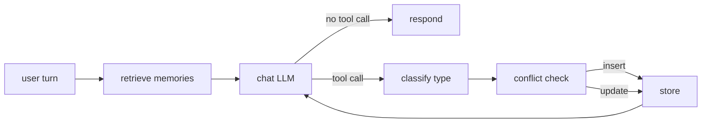

# sage-agent

## What this is

A memory-augmented conversational agent built on LangGraph, extending the
[`langchain-ai/memory-agent`](https://github.com/langchain-ai/memory-agent)
template with **semantic retrieval**, **conflict resolution**, **typed memory**
(facts / preferences / episodic events), and — most importantly — a **50-case
evaluation suite** that turns every "improvement" into a measurable delta
instead of a vibe.

The README leads with numbers, not features. Week 1 ships the baseline and
the eval harness so weeks 2–4 can claim measurable wins against it.

## Results

| Category               | Baseline | Week 2 (semantic + conflict) | Week 3 (typed) | Final |
|------------------------|---------:|-----------------------------:|---------------:|------:|
| `should_save_fact`     |  100.0% |                            — |              — |     — |
| `should_save_preference` | 100.0% |                            — |              — |     — |
| `should_save_episodic` |   80.0% |                            — |              — |     — |
| `should_not_save`      |  100.0% |                            — |              — |     — |
| `contradiction_update` |    0.0% |                            — |              — |     — |
| `retrieval_relevance`  |   90.0% |                            — |              — |     — |
| **Save-decision P / R / F1** | 1.000 / 0.967 / 0.983 | — / — / — | — / — / — | — / — / — |

> Baseline run: `openai/gpt-oss-120b:free` via OpenRouter, 50 cases, in-memory
> store, blind append, no semantic retrieval — see
> `tests/eval/results/baseline_20260524T094912Z.json`. `contradiction_update`
> sits at 0% by design (blind append can't update existing memories), which
> is the headroom Week 2's conflict-resolution subgraph is meant to consume.
> `retrieval_relevance` looks high at 90% only because the Phase 1 stub
> returns *all* user memories — Week 2's properly-scoped top-k retrieval has
> to match this number while also passing the negative cases the stub can't.

## Architecture



**Node-by-node** (Phase 1 status in parens):

- **retrieve memories** — embed the latest user message, query the vector
  store for top-k similar memories scoped to `user_id`, attach to state.
  *(Phase 1: stub — just dumps ALL memories from `InMemoryStore`. Real
  retrieval lands Week 2.)*
- **chat LLM** — system prompt + retrieved memories + history → either a
  natural response or a `save_memory` tool call. *(Phase 1: live.)*
- **classify type** — route the candidate memory to `fact` / `preference` /
  `episodic`. *(Phase 1: absent — everything is type-less.)*
- **conflict check** — semantic-search for similar existing memories, use an
  LLM judge to decide insert-vs-update. *(Phase 1: absent — every save is a
  blind append, which is why baseline tanks `contradiction_update`.)*
- **store** — write to the vector store + persistent backend, attaching
  type-specific retention metadata. *(Phase 1: `InMemoryStore.aput`, no
  metadata.)*

## How it works

**LangGraph state machine.** Each user turn enters at `call_model`. If the
model emits a `save_memory` tool call, the graph routes to `store_memory`
which executes the tool (injecting `store` and `user_id` from config),
appends a `ToolMessage`, and loops back to `call_model` so the LLM can
produce a natural response. If no tool call, the graph ends.

**Memory store.** Phase 1 uses `langgraph.store.memory.InMemoryStore` — a
`BaseStore` subclass that's a dict under the hood but exposes the right
interface so Week 2's Chroma swap is one constructor change. Namespace is
`("memories", user_id)`, matching the upstream template.

**Eval harness.** `tests/eval/cases.json` carries 50 cases across six
categories. The runner spins up a fresh store per case, optionally
pre-loads `setup_memories`, runs the conversation through the graph, and
scores against three predicates:

- `memory_content_contains` — **all** substrings must appear across newly-saved memories
- `response_contains` — **any** substring must appear in the final response
- `contradiction_update` — exactly one memory must remain for that user, carrying the new value

Results land in `tests/eval/results/baseline_<UTC>.json` alongside aggregate
metrics: per-category pass rate plus a global save-decision precision /
recall / F1 treating `should_save` as a binary classifier.

## Tradeoffs considered

**Local sentence-transformers vs OpenAI embeddings.** Local
(`all-MiniLM-L6-v2`) is $0 and good enough for thousands-scale stores. API
embeddings buy ~5% retrieval quality at the cost of a paid dependency that
breaks the project's $0 constraint. For a portfolio project where the
demo-on-free-tier story matters as much as the absolute metric, local wins.
The interface stays swappable.

**Chroma vs Pinecone.** Chroma is embedded and zero-ops — `pip install`
and you're done. Pinecone is a managed service: better scaling, a paid
account, and a deploy story this project doesn't need. Chroma also lets the
whole eval run offline in CI.

**Gemini Flash (via OpenRouter) vs Claude.** Claude has the best tool
calling, but Anthropic doesn't offer a sustained free tier. OpenRouter's
free-tier Gemini Flash 2.0 has the strongest tool calling among free
models, which is the deciding factor since `save_memory` is a tool call.
`model.py` is a one-function swap if you want to move to Claude later.

## Setup

```bash
# 1. Install deps (uv)
uv sync

# 2. Configure
cp .env.example .env
# edit .env and set OPENROUTER_API_KEY (free key at https://openrouter.ai/keys)

# 3. Chat with the agent
uv run python -m sage_agent.cli --user-id alice
```

CLI commands inside the REPL: `/new` (new thread, same user — memories
persist), `/memories` (dump store for this user), `/quit`.

## Running the eval

```bash
# Validate cases without hitting the API
uv run python -m tests.eval.runner --dry-run

# Smoke test (first 5 cases)
uv run python -m tests.eval.runner --limit 5

# Single category
uv run python -m tests.eval.runner --category should_save_fact

# Full 50-case run
uv run python -m tests.eval.runner
```

Each run writes `tests/eval/results/baseline_<UTC>.json` and prints a
summary table. Re-label with `--label week2` etc. when running improved
versions.

## Roadmap

- **Week 1** ✅ — Baseline ReAct agent (in-memory store, blind append, no
  retrieval) + 50-case eval harness + this README.
- **Week 2** — Semantic retrieval (Chroma + `all-MiniLM-L6-v2`) and
  conflict-resolution save subgraph (semantic-search the top-k similar,
  LLM judge to decide insert vs update). Ship gate: measurable improvement
  on `contradiction_update` and `retrieval_relevance`.
- **Week 3** — Typed memory: classifier node routes candidates to
  fact / preference / episodic; type-specific retention metadata; type-aware
  retrieval cues. Ship gate: improvement reflected in eval.
- **Week 4** — Decay / consolidation, Streamlit UI, hosted demo, README
  rewrite with final numbers, blog post. Ship gate: live demo URL.
