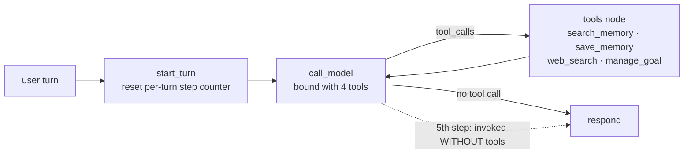

# sage-agent

> **Try it live:** [sage-agent.streamlit.app](https://sage-agent.streamlit.app/)
> · Tell the agent something about you, reload the page, ask it back.

## What this is

A memory-augmented **ReAct agent** built on LangGraph, extending the
[`langchain-ai/memory-agent`](https://github.com/langchain-ai/memory-agent)
template into a model-driven loop over four tools:

- **`search_memory`** — semantic top-`k` recall of what the user told you
  earlier (Chroma + local `all-MiniLM-L6-v2`), scoped to `user_id`.
- **`save_memory`** — persist a new memory, with **typed classification**
  (`fact` / `preference` / `episodic`) and **LLM-judge conflict resolution**
  (insert vs replace, replace as DELETE-then-INSERT).
- **`web_search`** — keyless external lookup (DuckDuckGo via `ddgs`) for
  current/external facts the user didn't supply.
- **`manage_goal`** — set / list / update user goals, stored as a separate
  `goal` memory type with `status` + `created_at`.

The model **chooses** which tool to call (or none) on each step — retrieval is
no longer a forced node. Two evaluation suites measure it: a **50-case memory
suite** (save decision, type, retrieval, contradiction handling) and a
**34-case action-selection suite** (did the model pick the right tool, in the
right order, without over-calling). The README leads with those numbers, not
the feature list.

## Results

Both suites run on `openai/gpt-oss-120b:free` via OpenRouter at temperature 0.
The free tier is non-deterministic even at temp 0, so action-selection is
reported as a **range across 3 runs**, not a single figure.

### 50-case memory eval

Source: `tests/eval/results/phase4_20260531T194151Z.json` (the agentic
re-baseline — retrieval is now model-driven, so these supersede the
pre-agentic week-by-week numbers).

| Category               | Pass rate | Type accuracy |
|------------------------|----------:|--------------:|
| `should_save_fact`     |  **100%** (10/10) | 90.0% (9/10) |
| `should_save_preference` | **100%** (8/8) | 87.5% (7/8) |
| `should_save_episodic` |   80.0% (4/5) | 60.0% (3/5) |
| `should_not_save`      |  **100%** (10/10) | — |
| `contradiction_update` |   85.7% (6/7) | 85.7% (6/7) |
| `retrieval_relevance`  |  **100%** (10/10) | — |
| **Save-decision P / R / F1** | **1.000 / 0.967 / 0.983** | (tp29 fp0 fn1 tn20) |
| **Type accuracy (global)** | **83.3%** (25/30 eligible) | |

Reading the rows honestly:

- **`contradiction_update` is 85.7%, not 100%.** Same-facet updates collapse
  the prior memory correctly in 6 of 7 cases; the holdout is the case_040
  Camry→Tesla substitution, which the free-tier judge flips across re-runs.
  The pre-agentic README claimed a bare 100% on one lucky polish run — that
  overclaim is removed.
- **`retrieval_relevance` holds at 100% even though retrieval is now a tool the
  model decides to call** — the model reliably chooses `search_memory` when the
  answer is in memory.
- **Save-decision F1 = 0.983 is the headline invariant.** The single false
  negative (R=0.967) is the long-standing case_021 episodic miss. F1 holds
  because `replace` is implemented as DELETE-then-INSERT, so it still counts as
  a save.
- **Type accuracy 83.3%** — strong on facts and contradiction updates; the
  classifier stays fuzzy on borderline preference-vs-fact ("does not drink
  coffee" → fact) and episodic-vs-fact ("graduated from IIT Delhi in 2018" →
  episodic on the temporal anchor). Free-tier prompt tuning didn't reliably
  move that needle.

### Action-selection eval (34 cases, 3 runs)

Sources: `tests/eval/results/phase4b_run1_20260603T201244Z.json`,
`…run2_20260603T201731Z.json`, `…run3_20260603T202201Z.json`. A case passes
only if the model calls **exactly** the expected tool(s) — hitting the target
tool **and** not over-calling; chained cases must match an ordered
`expected_sequence`.

| Run | Overall | Failing cases |
|----:|--------:|---------------|
| 1 | **94.1%** (32/34) | `act_031`, `act_032` |
| 2 | **94.1%** (32/34) | `act_031`, `act_032` |
| 3 | **91.2%** (31/34) | `act_029`, `act_031`, `act_032` |

**Range 91.2% – 94.1%, mean 93.1%.** Per-category on the worst run (run 3):
`search_memory` 4/4, `web_search` 6/6, `manage_goal` 7/7, `save_memory` 6/6,
`should_no_tool` 7/9, `should_chain` 1/2.

The sub-100% is the interesting finding, not noise to hide — it's a real
**over-action bias** in the free-tier model:

- **`act_031` (fails 3/3, over-call).** "I finally did it — please mark my goal
  as done!" with **two** active goals in the store. The safe move is to *ask
  which goal* (no tool); the model fires `manage_goal` anyway and risks closing
  the wrong one. The model won't ask a clarifying question when an action is on
  offer. *(Label is intentionally strict — calling `manage_goal(list)` to show
  options is also defensible; documented as debatable.)*
- **`act_032` (fails 3/3, over-call).** "Remind me what my name is — oh wait,
  never mind, it's Alex." The user supplies the answer mid-sentence, so any
  tool call is wasted; the model calls `save_memory` regardless.
- **`act_029` (fails 1/3, flaky chain).** "What's the weather where I live right
  now?" with the city in memory. Expected `search_memory` → `web_search`; in
  run 3 the model called **no tool** and answered from nothing. The ordered
  chain scorer catches the dropped multi-step plan. Passed in runs 1–2.

Net: 93% is not a ceiling to celebrate — it reflects two genuine over-call
traps and one non-deterministic chain. Every miss is named here rather than
averaged away.

## Architecture



The graph is `START → start_turn → call_model ⇄ tools → END` — a model-driven
ReAct loop, not a fixed pipeline.

- **`start_turn`** resets `State.step` to 0 at the top of each user turn. The
  step counter is load-bearing under the CLI/Streamlit checkpointer, where
  `State` persists across turns.
- **`call_model`** binds all four tools and either emits tool calls or answers
  in plain text. On the `MAX_MODEL_STEPS` (=5) th step it is invoked **without**
  tools, so a tool call is impossible and the loop is guaranteed to terminate
  with a text answer. This is the per-turn cap that bounds the ReAct loop on a
  free model.
- **`tools` node** executes every tool call with **one retry then graceful
  degradation** (an error `ToolMessage`, never a crashed turn), then loops back
  to `call_model` so the model can read the results and continue:
  - `search_memory` — embed the query (`all-MiniLM-L6-v2`), Chroma top-`k`
    (=5) scoped to `("memories", user_id)`. The old forced `retrieve_memories`
    node is gone; retrieval is now a tool the model *chooses*.
  - `save_memory` — semantic-search top-3 neighbors; if none, a dedicated
    classifier assigns the type; if neighbors exist, an LLM judge classifies
    **and** decides insert-vs-replace in one structured-output call.
    Conflict resolution lives **inside** the save path (not a separate node)
    so the N tool_calls / N ToolMessages pairing the model expects stays
    intact. `replace` is DELETE-then-INSERT with a fresh UUID.
  - `web_search` — `ddgs` DuckDuckGo, no API key; the sync call runs in
    `asyncio.to_thread`, and a "no results" outcome degrades to a readable
    message rather than an error.
  - `manage_goal` — `set` / `list` / `update` over `goal`-type memories;
    `update` reuses the same DELETE-then-INSERT pattern (new UUID, original
    `created_at` preserved) so a status change updates in place.

## How it works

**Model-driven retrieval.** There is no forced retrieve step. The
`SYSTEM_PROMPT` routes tool choice — `search_memory` for facts about the user,
`web_search` for current/external facts, `manage_goal` for aims and progress,
and *no tool* when the answer is direct knowledge. The 50-case
`retrieval_relevance` rows confirm the model reliably calls `search_memory`
when memory holds the answer.

**Typed memory, including goals.** Every memory carries a `type`. The
auto-classifier and judge can only emit the three *classifiable* types
(`fact` / `preference` / `episodic`) — `goal` is reachable **only** through
`manage_goal`, never the `save_memory` path. A narrow `ClassifiableType`
literal enforces this isolation, which also means the judge can never
replace/delete a goal as a side effect of an ordinary save.

**Conflict resolution.** For each save, the judge gates `replace` on
same-type-AND-same-facet; cross-type replacements are downgraded to `insert`
by a post-validator. Replace is DELETE-then-INSERT (not upsert) so the
save-decision metric still counts it as a save.

**Memory store.** `ChromaStore` is a `BaseStore` subclass wrapping a single
Chroma collection (`sage_memories`); the langgraph contract is satisfied by
implementing `batch` / `abatch`. Namespace tuples are encoded as metadata so
one collection holds memories for every user (isolation is a where-filter on
every op). `make_store()` returns an `EphemeralClient` (eval is hermetic per
case); `make_store(persist_dir=".chroma/")` is what the CLI / Streamlit use for
cross-process persistence. The store carries optional `status` / `created_at`
through for goal memories without affecting non-goal ones.

**Two eval harnesses.**

- `tests/eval/runner.py` (50 cases, six categories) — fresh store per case,
  optional `setup_memories`, runs the conversation through the graph, scores
  save decision, type accuracy, retrieval relevance, and contradiction
  collapse. It additionally **captures per-turn tool calls** (additive; memory
  scoring is byte-for-byte unchanged).
- `tests/eval/action_runner.py` (34 cases, six tool-choice categories) — reuses
  `run_case` and scores `passed = (called_tools == expected)`, i.e. hit the
  expected tool **and** didn't over-call. `should_chain` cases score an ordered
  `expected_sequence`. `--runs N` reports an accuracy range across N runs.

Results land in `tests/eval/results/<label>_<UTC>.json` with per-category and
aggregate metrics. Those files are committed so the README numbers are
reproducible from git history.

## Tradeoffs considered

**Retrieval as a tool vs a forced node.** The pre-agentic graph always ran a
`retrieve_memories` node before the model. Making retrieval a tool the model
*chooses* is the core of the ReAct conversion — it lets the model skip
retrieval when it isn't needed (direct-knowledge answers) and call it
mid-reasoning when it is. The risk was that the free-tier model wouldn't call
it reliably; the 100% `retrieval_relevance` rows show it does.

**Capped ReAct loop on a free model.** An unbounded tool loop on a non-frontier
free model can spin. The 5-step per-turn cap, with the final step invoked
*without* tools, makes termination a structural guarantee rather than a
hope — at the cost of capping any single turn at four tool calls.

**Classifier isolated from the `goal` type.** Goals share the Chroma store with
memories but are reachable only via `manage_goal`; the save-path classifier and
judge are typed to `ClassifiableType` so they physically cannot emit `goal`.
This keeps an offhand "I want to learn French" from being silently filed as a
goal by `save_memory`, and protects goals from judge-driven replacement.

**Local sentence-transformers vs API embeddings.** Local (`all-MiniLM-L6-v2`)
is $0 and good enough for thousands-scale stores. API embeddings buy ~5%
retrieval quality at the cost of a paid dependency that breaks the project's
$0 constraint. The interface stays swappable.

**Chroma vs Pinecone.** Chroma is embedded and zero-ops — `pip install` and
you're done; the whole eval runs offline. Pinecone is a managed paid service
this project doesn't need.

**`openai/gpt-oss-120b:free` (via OpenRouter) vs Claude.** Claude has the best
tool calling, but Anthropic has no sustained free tier. `gpt-oss-120b:free` has
the strongest tool calling among current free OpenRouter models — the deciding
factor, since `save_memory`, the conflict-resolution judge, and now four-tool
action selection are all tool / structured-output calls. `model.py` is a
one-function swap to move to Claude. (The original baseline used
`gemini-2.0-flash-exp:free`; OpenRouter retired it in early 2026.)

**Keyless `ddgs` for web search.** DuckDuckGo via `ddgs` needs no API key,
preserving the $0 constraint. The trade is reliability: `ddgs` raises on empty
results and is rate-limited, so the tool re-raises real failures into the
graph's retry-once-then-degrade path and only swallows the genuine "no results"
case.

**DELETE-then-INSERT, not upsert.** Conflict-resolution's `replace` deletes the
matched memory and inserts a new UUID-keyed one rather than overwriting in
place. The runner counts new memories by filtering out `setup_`-prefixed keys;
a same-key overwrite would pass the per-category predicate but tank
save-decision recall. The new UUID makes the case a true positive.

**Lazy embedder load.** `all-MiniLM-L6-v2` loads on first call, not at import,
so `--help` and dry-runs don't pay the 3–5s cost.

## Setup

```bash
# 1. Install deps (uv)
uv sync

# 2. Configure
cp .env.example .env
# edit .env and set OPENROUTER_API_KEY (free key at https://openrouter.ai/keys)

# 3a. Chat with the agent in the terminal
uv run python -m sage_agent.cli --user-id alice

# 3b. Or launch the Streamlit UI
uv run streamlit run src/sage_agent/app.py
```

CLI commands inside the REPL: `/new` (new thread, same user — memories
persist), `/memories` (dump store for this user), `/quit`. The Streamlit UI
shows the same memories panel in the sidebar, type-tagged, and persists across
page reloads via `.chroma/`.

## Deploying the UI (Streamlit Community Cloud)

The `src/sage_agent/app.py` entry point is ready for Streamlit Cloud:

1. Push the repo to GitHub (public or private with Cloud access).
2. At [streamlit.io/cloud](https://streamlit.io/cloud), click **New app**,
   point to this repo + branch, set the main file to
   `src/sage_agent/app.py`.
3. In **Advanced settings → Secrets**, add:
   ```toml
   OPENROUTER_API_KEY = "sk-or-v1-..."
   ```
4. Deploy. First boot downloads the `all-MiniLM-L6-v2` embedder (~3-5s);
   subsequent loads are warm-cached by `@st.cache_resource`.

Streamlit Cloud reads `pyproject.toml` natively — no `requirements.txt` needed.
If you hit dep resolution issues, generate one with
`uv export --format requirements-txt > requirements.txt` and commit it.
(Note: the Cloud filesystem resets on reboot, so `.chroma/` is not durable
there — memories persist within a session, not across Cloud restarts.)

## Running the eval

```bash
# Memory suite — validate cases without hitting the API
uv run python -m tests.eval.runner --dry-run

# Memory suite — smoke test (first 5 cases)
uv run python -m tests.eval.runner --limit 5

# Memory suite — single category
uv run python -m tests.eval.runner --category should_save_fact

# Memory suite — full 50-case run with a label
uv run python -m tests.eval.runner --label phase4

# Action-selection suite — 34 cases, 3 runs for an accuracy range
uv run python -m tests.eval.action_runner --runs 3 --label phase4b
```

Each run writes `tests/eval/results/<label>_<UTC>.json` and prints a summary
table.

**Re-scoring offline.** When scoring rules change but the agent's outputs
haven't, `tests/eval/rescore.py` re-applies `score_case` and `aggregate` to a
stored results JSON without hitting the LLM:

```bash
uv run python -m tests.eval.rescore tests/eval/results/phase4_<UTC>.json
```

## Roadmap

- **Memory system (Weeks 1–4)** ✅ — Baseline ReAct agent + 50-case eval
  harness; semantic retrieval (Chroma + `all-MiniLM-L6-v2`); LLM-judge
  conflict-resolution save subgraph (DELETE-then-INSERT); typed memory
  (`fact` / `preference` / `episodic`) with a type-accuracy metric; Streamlit
  UI + hosted demo on [Streamlit Community Cloud](https://sage-agent.streamlit.app/).
- **Agentic build** ✅ — Converted the fixed retrieve→respond→save pipeline into
  a model-driven **ReAct loop** with a per-turn step cap, and grew the tool set:
  - `search_memory` — retrieval as a chosen tool, not a forced node.
  - `web_search` — keyless DuckDuckGo (`ddgs`) external lookup.
  - `manage_goal` + a `goal` memory type, isolated from the save classifier.
  - **Action-selection eval** — a 34-case suite scoring tool choice (including
    ordered two-tool chains and over-call traps), plus a 50-case memory
    re-baseline on the agentic graph.
- **Future** — Decay / consolidation (TTL on episodic memories, periodic
  dedupe); reflection / auto-summarization of accumulated memories; blog post;
  second-opinion eval with a different model (Claude / GPT-4-class) to
  cross-check the free-tier numbers; tightening `should_save_episodic`
  (case_021) and the `should_no_tool` over-action traps (`act_031`, `act_032`).
```
