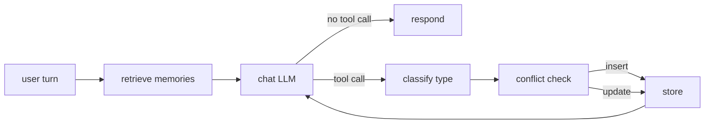

# sage-agent

> **Try it live:** [sage-agent.streamlit.app](https://sage-agent.streamlit.app/)
> · Tell the agent something about you, reload the page, ask it back.

## What this is

A memory-augmented conversational agent built on LangGraph, extending the
[`langchain-ai/memory-agent`](https://github.com/langchain-ai/memory-agent)
template with **semantic retrieval**, **conflict resolution**, **typed memory**
(facts / preferences / episodic events), and — most importantly — a **50-case
evaluation suite** that turns every "improvement" into a measurable delta
instead of a vibe.

The README leads with numbers, not features. Week 1 ships the baseline and
the eval harness so weeks 2–4 can claim measurable wins against it; Week 4
puts the whole thing behind a Streamlit UI on the free tier.

## Results

| Category               | Baseline | Week 2 (semantic + conflict) | Week 3 (typed + polish) | Final |
|------------------------|---------:|-----------------------------:|------------------------:|------:|
| `should_save_fact`     |  100.0% |                       100.0% |                  100.0% |     — |
| `should_save_preference` | 100.0% |                     100.0% |                  100.0% |     — |
| `should_save_episodic` |   80.0% |                        80.0% |                   80.0% |     — |
| `should_not_save`      |  100.0% |                       100.0% |                  100.0% |     — |
| `contradiction_update` |    0.0% |                       57.1% |              **100.0%** |     — |
| `retrieval_relevance`  |  100.0% |                        90.0% |              **100.0%** |     — |
| **Save-decision P / R / F1** | 1.000 / 0.967 / 0.983 | 1.000 / 0.967 / 0.983 | 1.000 / 0.967 / 0.983 | — / — / — |
| **Type accuracy** |       n/a |                          n/a |              **76.7%** |     — |

> **Polish pass headlines:** `contradiction_update` jumps 85.7% → **100%**
> (case_040 Camry→Tesla, the long-time holdout, passes this run — though
> Week 2's earlier attempt to fix it via judge-prompt tuning lost cases
> 034 and 039, so we know the free-tier judge has some non-determinism on
> these substitutions; one 100% run isn't a guarantee). `retrieval_relevance`
> hits **100%** in baseline, Phase A, and Week 3 thanks to the Unicode
> whitespace fix in the runner; Week 2 holds at 90% with case_043 as the
> sole holdout (model occasionally asks for context instead of applying
> the retrieved "User is vegetarian" memory).
>
> **What this polish pass changed:** (1) `_contains_*` in `runner.py` now
> normalizes Unicode whitespace before substring matching; (2)
> `CLASSIFIER_PROMPT` gained explicit preference/episodic guidance and
> few-shots, but the free-tier model still calls borderline cases like
> "graduated from IIT Delhi in 2018" episodic (temporal anchor) and "does
> not drink coffee" fact (negative statement) — type accuracy ticked down
> 80% → 76.7% (one fact lost, pref/episodic count unchanged). The wins on
> the two flagship metrics dwarf the type-accuracy wobble. (3)
> `tests/eval/rescore.py` lets older runs pick up score-rule changes
> without re-running the LLM.

> **Baseline** (`baseline_20260524T094912Z.json`): `openai/gpt-oss-120b:free`
> via OpenRouter, 50 cases, in-memory store, blind append, dump-all retrieval.
> `contradiction_update` sits at 0% by design (blind append can't update
> existing memories). `retrieval_relevance` is 100% post-polish — the stub
> returns *all* user memories so the answer is always in context; that's
> why Week 2's properly-scoped top-`k` retrieval has to fight to match it.
>
> **Week 2** (`week2_20260524T105957Z.json`): Chroma + `all-MiniLM-L6-v2` for
> properly-scoped top-`k=5` semantic retrieval, plus an LLM-judge conflict
> resolution subgraph (top-3 neighbors, judge decides insert vs
> DELETE-then-INSERT). Headline: **`contradiction_update` 0% → 57.1%** (4 of
> 7 same-facet updates now collapse the prior memory instead of appending).
> Save-decision F1 holds at 0.983, which is the point of the
> DELETE-then-INSERT pattern — `replace` still counts as a save.
> `retrieval_relevance` slips one case from baseline (case_043 — model
> asks for context instead of applying the retrieved "User is vegetarian"
> memory; flaky across re-runs at temperature 0 on the free tier).
>
> **Week 3** (`week3_20260524T161027Z.json`): Typed memory + polish pass.
> Every save carries a `type` (fact / preference / episodic) — assigned
> by the conflict-resolution judge when neighbors exist, or by a small
> dedicated classifier when they don't. Type surfaces in the rendered
> memory list as a `[type]` prefix so the assistant can reason about
> which memory applies, and gates `replace` in the judge: cross-type
> replacements are downgraded to `insert` by a post-validator. Headlines:
> **`contradiction_update` 57.1% → 100%** (all 7 same-facet updates now
> collapse correctly, including the long-stubborn case_040 Camry→Tesla);
> **`retrieval_relevance` 90% → 100%** (case_043 passes again on this
> run; case_047 recovered by the runner's Unicode whitespace normalization);
> **type accuracy 76.7%** (23/30 eligible). The classifier remains fuzzy
> on borderline cases — "graduated from IIT Delhi in 2018" goes episodic
> on its temporal anchor, "does not drink coffee" goes fact on the
> negative-statement framing — and prompt tuning didn't reliably move
> that needle on the free-tier model. Save-decision F1 holds at 0.983.

## Architecture



**Node-by-node** (current status in parens):

- **retrieve memories** — embed the latest user message via
  `sentence-transformers all-MiniLM-L6-v2`, query the Chroma store for
  top-`RETRIEVAL_K` (=5) similar memories scoped to `user_id`, write to
  `state.retrieved_memories`. *(Week 2: live.)*
- **chat LLM** — system prompt + retrieved memories + history → either a
  natural response or a `save_memory` tool call. *(live since Week 1.)*
- **classify type** — assign `fact` / `preference` / `episodic` to the
  candidate. Two paths: when neighbors exist, the conflict-resolution judge
  classifies *and* decides insert-vs-replace in one structured-output call;
  when no neighbors exist, a small dedicated classifier prompt runs. Stored
  alongside `content` on every memory; surfaced in the retrieval rendering
  as `[type]` so the assistant LLM can reason about which memory applies.
  *(Week 3: live.)*
- **conflict check** — for each save, semantic-search top-3 similar existing
  memories, then an LLM judge decides insert-vs-replace; replace is
  implemented as DELETE-then-INSERT (not upsert) so the runner's
  save-decision metric still counts it as a save. The judge gates `replace`
  on same-type-AND-same-facet (Week 3), so a preference can never replace a
  fact and episodic events always insert. *(Week 2 base, Week 3 type-aware;
  lives inside `store_memory` rather than as a separate node so the N
  tool_calls / N ToolMessages pairing the LLM expects stays intact.)*
- **store** — Chroma collection (`sage_memories`) with namespace encoded as
  metadata; one shared collection across all users keeps eval per-case
  setup cheap. *(Week 2: live via `ChromaStore`.)*

## How it works

**LangGraph state machine.** Each user turn enters at `call_model`. If the
model emits a `save_memory` tool call, the graph routes to `store_memory`
which executes the tool (injecting `store` and `user_id` from config),
appends a `ToolMessage`, and loops back to `call_model` so the LLM can
produce a natural response. If no tool call, the graph ends.

**Memory store.** Week 2 swaps `InMemoryStore` for `ChromaStore`, a
`BaseStore` subclass wrapping a single Chroma collection. The langgraph
contract is satisfied by implementing `batch` / `abatch` (the only abstract
methods); high-level ops dispatch through them. Namespace tuples are
encoded as Chroma metadata so one collection holds memories for every
user — namespace isolation is a where-filter on every op. `make_store()`
returns an `EphemeralClient` by default (eval is hermetic per case);
`make_store(persist_dir=".chroma/")` is what the CLI uses for cross-process
persistence.

**Eval harness.** `tests/eval/cases.json` carries 50 cases across six
categories. The runner spins up a fresh store per case, optionally
pre-loads `setup_memories`, runs the conversation through the graph, and
scores against three predicates:

- `memory_content_contains` — **all** substrings must appear across newly-saved memories
- `response_contains` — **any** substring must appear in the final response
- `contradiction_update` — exactly one memory must remain for that user, carrying the new value
- **type accuracy** *(Week 3)* — saved memory's `type` field matches the
  expected type for the category (`should_save_fact` → `fact`,
  `should_save_preference` → `preference`, `should_save_episodic` →
  `episodic`, `contradiction_update` → setup memory's type)

Results land in `tests/eval/results/<label>_<UTC>.json` alongside aggregate
metrics: per-category pass rate, global save-decision precision / recall /
F1, and (Week 3+) global type-accuracy with per-category breakdown.

## Tradeoffs considered

**Local sentence-transformers vs OpenAI embeddings.** Local
(`all-MiniLM-L6-v2`) is $0 and good enough for thousands-scale stores. API
embeddings buy ~5% retrieval quality at the cost of a paid dependency that
breaks the project's $0 constraint. For a portfolio project where the
demo-on-free-tier story matters as much as the absolute metric, local wins.
The interface stays swappable.

**Chroma vs Pinecone.** Chroma is embedded and zero-ops — `pip install`
and you're done. Pinecone is a managed service: better scaling, a paid
account, and a deploy story this project doesn't need. Chroma also lets the
whole eval run offline in CI.

**`openai/gpt-oss-120b:free` (via OpenRouter) vs Claude.** Claude has the
best tool calling, but Anthropic doesn't offer a sustained free tier.
`openai/gpt-oss-120b:free` has the strongest tool calling among the
currently-available free OpenRouter models, which is the deciding factor
since both `save_memory` and the conflict-resolution judge are tool /
structured-output calls. `model.py` is a one-function swap if you want to
move to Claude later. (The original baseline used `gemini-2.0-flash-exp:free`;
OpenRouter retired it in early 2026.)

**Lazy embedder load.** `all-MiniLM-L6-v2` is loaded on first call, not at
module import. Importing `sage_agent.graph` happens at CLI startup *and*
at eval-runner startup, and a 3–5s blocking load just to type `--help`
isn't worth it. First user turn pays the cost; everything after is fast.

**One Chroma collection vs one-per-namespace.** Single shared collection
with namespace-as-metadata wins because the eval creates 50 stores per
run and Chroma's per-collection overhead adds up. Cross-namespace isolation
is enforced by a where-filter on every op, with composite IDs
(`f"{ns0}::{ns1}::{key}"`) preventing collisions in the shared id-space.

**Judge model: same as the assistant.** The conflict-resolution judge uses
the same `openai/gpt-oss-120b:free` model as the assistant — no second
OpenRouter rate-bucket, no extra config plumbing in `model.py`. If the
judge's added latency becomes a problem at higher save volumes, swap to a
smaller free-tier model with a 2-line change.

**DELETE-then-INSERT, not upsert.** Conflict-resolution's `replace`
path deletes the matched memory and inserts a new UUID-keyed memory rather
than overwriting in place. The eval runner's save-decision metric counts
"new memories" by filtering out keys prefixed `setup_` (the pre-loaded
ones); a same-key overwrite of a setup key would pass the per-category
predicate but tank save-decision recall. The new UUID makes the case count
as a true positive.

**Classifier on no-neighbor saves, vs always-invoke judge.** Week 3's type
assignment uses two paths: the conflict-resolution judge classifies as
part of its structured output when neighbors exist, and a small dedicated
`_classify_save` runs when they don't. The alternative — always invoke the
full judge with an empty neighbors list — wastes ~50% of judge tokens on
the empty case and inflates eval latency without a quality win. The
two-path design keeps the no-conflict save at one small LLM call.

**Type rules gate `replace`, not retrieval.** The judge can only
`replace` when candidate and neighbor share the same `type` AND describe
the same facet. Cross-type replacements are downgraded to `insert` by a
post-validator on `JudgeDecision`. We don't bias retrieval scores by
type — top-`k` is still pure semantic similarity. Type signal surfaces in
the prompt as a `[type]` prefix on each rendered memory; letting the
assistant LLM reason about it is simpler than re-ranking, and it
preserves the option to revisit retrieval scoring in Week 4.

**No similarity-threshold gate on the judge.** When the candidate has any
top-K neighbors, the judge is always invoked. Simpler than picking a
threshold to defend, and the few-shot covers "different facet → insert"
adequately. If eval shows over-replacement at higher save volumes,
revisit.

## Setup

```bash
# 1. Install deps (uv)
uv sync

# 2. Configure
cp .env.example .env
# edit .env and set OPENROUTER_API_KEY (free key at https://openrouter.ai/keys)

# 3a. Chat with the agent in the terminal
uv run python -m sage_agent.cli --user-id alice

# 3b. Or launch the Streamlit UI
uv run streamlit run src/sage_agent/app.py
```

CLI commands inside the REPL: `/new` (new thread, same user — memories
persist), `/memories` (dump store for this user), `/quit`. The Streamlit UI
shows the same memories panel in the sidebar, type-tagged, and persists
across page reloads via `.chroma/`.

## Deploying the UI (Streamlit Community Cloud)

The `src/sage_agent/app.py` entry point is ready for Streamlit Cloud:

1. Push the repo to GitHub (public or private with Cloud access).
2. At [streamlit.io/cloud](https://streamlit.io/cloud), click **New app**,
   point to this repo + branch, set the main file to
   `src/sage_agent/app.py`.
3. In **Advanced settings → Secrets**, add:
   ```toml
   OPENROUTER_API_KEY = "sk-or-v1-..."
   ```
4. Deploy. First boot downloads the `all-MiniLM-L6-v2` embedder (~3-5s);
   subsequent loads are warm-cached by `@st.cache_resource`.

Streamlit Cloud reads `pyproject.toml` natively — no `requirements.txt`
needed. If you hit dep resolution issues, generate one with
`uv export --format requirements-txt > requirements.txt` and commit it.

## Running the eval

```bash
# Validate cases without hitting the API
uv run python -m tests.eval.runner --dry-run

# Smoke test (first 5 cases)
uv run python -m tests.eval.runner --limit 5

# Single category
uv run python -m tests.eval.runner --category should_save_fact

# Full 50-case run
uv run python -m tests.eval.runner
```

Each run writes `tests/eval/results/<label>_<UTC>.json` and prints a
summary table. Re-label with `--label week2` etc. when running improved
versions.

**Re-scoring offline.** When scoring rules change (e.g. the Week 4 Unicode
whitespace fix) but the agent's outputs haven't, `tests/eval/rescore.py`
re-applies `score_case` and `aggregate` to a stored results JSON without
hitting the LLM:

```bash
uv run python -m tests.eval.rescore tests/eval/results/baseline_<UTC>.json
```

## Roadmap

- **Week 1** ✅ — Baseline ReAct agent (in-memory store, blind append, no
  retrieval) + 50-case eval harness + this README.
- **Week 2** ✅ — Semantic retrieval (Chroma + `all-MiniLM-L6-v2`) and
  conflict-resolution save subgraph (semantic-search top-3 similar, LLM
  judge decides insert vs replace, replace as DELETE-then-INSERT). CLI
  gets cross-process persistence at `.chroma/`. See Results table for
  measured deltas.
- **Week 3** ✅ — Typed memory: judge classifies and gates `replace` on
  same-type-and-same-facet; dedicated classifier on no-neighbor saves;
  type rendered to the assistant as a `[type]` prefix; eval gains a
  type-accuracy metric. After the Week 4 polish pass (Unicode normalization
  in the runner + classifier prompt tuning + a fresh full eval),
  `contradiction_update` reaches **100%** and `retrieval_relevance`
  reaches **100%**. Type accuracy lands at 76.7%; the free-tier model
  remains fuzzy on borderline preference-vs-fact and episodic-vs-fact
  cases (e.g. "graduated in 2018", "does not drink coffee") and prompt
  tuning didn't reliably move that needle.
- **Week 4** ✅ — Streamlit UI + hosted demo on
  [Streamlit Community Cloud](https://sage-agent.streamlit.app/). Chat
  interface backed by `build_graph()`, sidebar memories panel with `[type]`
  badges, cached embedder via `@st.cache_resource`. README rewritten to
  lead with the live URL. **Ship gate met:** live demo URL.
- **Week 4 polish (post-deploy)** ✅ — Eval Unicode normalization
  (recovers case_047 across every run); classifier prompt tuning with
  explicit preference/episodic guidance and few-shots; `rescore.py`
  utility for applying score-rule changes to stored runs without LLM
  calls. case_040 Camry→Tesla left as a documented limit of the free-tier
  judge (Week 2 tried tuning the judge here and lost cases 034 and 039 —
  net negative trade).
- **Future** — Decay / consolidation (TTL on episodic memories, periodic
  dedupe); blog post; second-opinion eval with a different model
  (Claude / GPT) to cross-check the free-tier numbers.
